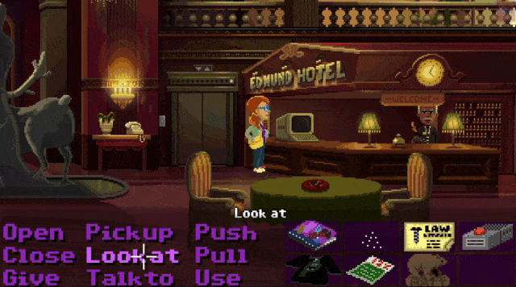

# r2-ggpack

Suite of [r2](http://rada.re) plugins to read and manipulate the **ggpack** data files used by [Thimbleweed Park game](https://thimbleweedpark.com/) (if you don't know this game yet, please go and buy it because it rocks).

## Disclaimer

This is a totally unofficial, unwanted and unrequested work, based on reverse engineering.

Expect a lot of bugs, if you're brave enough to open your data files in write mode with this plugin **be sure to work on a copy** and **make a full game backup first**.

## Show / Cinema



The above was made in this way:

[](https://asciinema.org/a/mnWkNEhqqRx6s2pEJl0xODkuu)

## Thanks

This wouldn't have been possible without the hints contained in the awesome [https://github.com/mstr-/twp-ggdump](https://github.com/mstr-/twp-ggdump) (even if it turned out that abstraction was wrong)

## Why

- because it's fun
- to allow more reversing of the game (in the hope to ease the burden of re-writing its engine in the open sources in the future)
- to enable full mods

## What you can do

- read the contents of the ggpack files
	- browse all files into the ggpack
	- search for content
	- edit them in-place using r2
- dump the content to files
- edit the unpacked files with external editors (GIMP, etc)
- import them again into the ggpack, so that you can just plug that back in the game and see your modifications

## How does it work

- there's an **RIO** plugin which does most of the job:
	- on-the-fly deobfuscation / obfuscation
	- index directory management

- a shallow **RBin** plugin just puts a flag for each packed file
- a dumb python test suite exists to ensure a minimum level of internal coherence

## Installing

Make sure you have [radare2 from git](https://github.com/radare/radare2) before compiling, then just do:

```
git clone https://github.com/mrmacete/r2-ggpack.git
cd r2-ggpack
make install
```

## Usage

Open your data file by invoking radare2 in this way:

```
$ r2 ggpack://path/to/your/ThimbleweedPark.ggpack1
```

If you want to modify it (see the disclaimer first):

```
cp /Absolute/path/to/original/ThimbleweedPark.ggpack1 ./test-twp.ggpack1
r2 -w ggpack:///Path/to/test-twp.ggpack1
```

There are also a couple of r2pipe scripts:

- **ggimport.py**: pass it the path to a file, it'll replace the content with the same name in the ggpack, taking into account size differences
- **ggexport.py**: pass it the output directory name (it must exist) and it dumps all resources there

Here's a quick example:

```
$ggexport=#!pipe python ./ggexport.py
$ggimport=#!pipe python ./ggimport.py

$ggexport dest_dir
$ggimport /path/to/my/NotebookSheet.png
```
